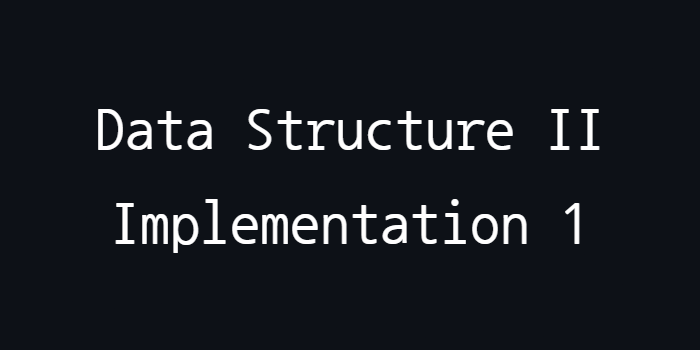

<p align="center">
  
</p>

## Overview

- This project implements various sorting algorithms, including BuildHeap, Selection Sort, Insertion Sort, and MergeSort. 
- The BuildHeap algorithm is utilized to find the largest element in a priority queue
- MergeSort is employed to calculate the median of two arrays
- BuildHeap, Selection Sort, and Insertion Sort are combined to create a new sorting algorithm called BHSI-Sort
<p>This project was developed during the Data Structure II course

## Features

- **BuildHeap**: Efficiently constructs a heap from an array, allowing for quick access to the largest element
- **Selection Sort**: A straightforward sorting algorithm that repeatedly selects the smallest (or largest) element from the unsorted portion and moves it to the sorted portion
- **Insertion Sort**: Builds a sorted array one element at a time
- **MergeSort**: A divide-and-conquer algorithm that splits arrays into smaller subarrays, sorts them, and merges them back together
- **BHSI-Sort**: A novel sorting algorithm that combines the aforementioned algorithms for enhanced sorting efficiency
- **Complexity Analysis**: Evaluates and compares the performance and complexity of operations based on the chosen data structures

## Problems

1. Develop a program in Java that takes as input the array V1, which consists of n numbers, as well as an array P that contains values p0, ..., pk, which are integers in the range {1, ..., n}. You can assume that k < n. The algorithm should generate an output array O that contains the rj-th largest number for each j ∈ {1, ..., k}. Therefore, if a pj = 5 in the input array P, we want to return the fifth largest element of the input array V1 as part of the output. We are looking for an algorithm with a time complexity of O(n log k).
    <p>Example:
    <p>Inputs: V1 = [21, 19, 16, 13, 8, 5.3, 20]; P=[2, 5]
    <p>Output: [8, 19]
    <p>Explanation: 8 is the second largest element of V1 and 19 is the fifth largest element of V1.    
    <p>[19, 8] is also an acceptable result.

2. Develop a program in Java that returns the median of all elements from two arrays of length n of the same data type. Consider that the arrays can contain numbers or strings. Describe the solution and explain the asymptotic behavior of the proposed algorithm.

3. Consider an array V of random integers with numbers between 1 and K, where K is an integer. We want to find out if there are two elements in the array that are a distance T apart from each other, that is, that differ by T units.
- a) Write a simple Java program that solves the problem in O(n^2).
- b) Write a simple Java program that solves it in O(n log n).

4. Implement a Java program called BHSI-Sort, combining BuildHeap + Selection Sort + Insertion Sort. To use this algorithm, the user must first build the Heap (Max or Min). Then, sort the defined ends in %E of the array size using Selection Sort. Finally, sort the central elements using Insertion Sort.


## Solving

- The complete report with the solutions can be accessed in this [PDF](pdf/Relatorio.pdf)

## Installation and Usage
To compile and run this project, follow these steps:
1. Install Java JDK
2. Clone the repository:
   ```sh
   git clone https://github.com/GiuliaFreulon/data-structure-II-implementation-1
   cd data-structure-II-implementation-1
3. Compile the program:
   ```bash
   cd src
   javac -d ../bin Main.java
4. Run the program:
   ```bash
   cd ../bin
   java Main
   
## License
This project is licensed under the MIT License. See the [LICENSE](LICENSE) file for details.
